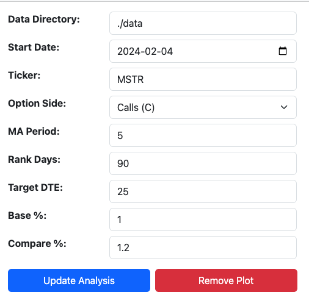
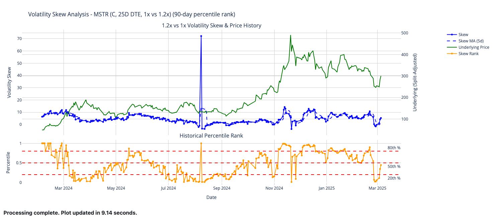
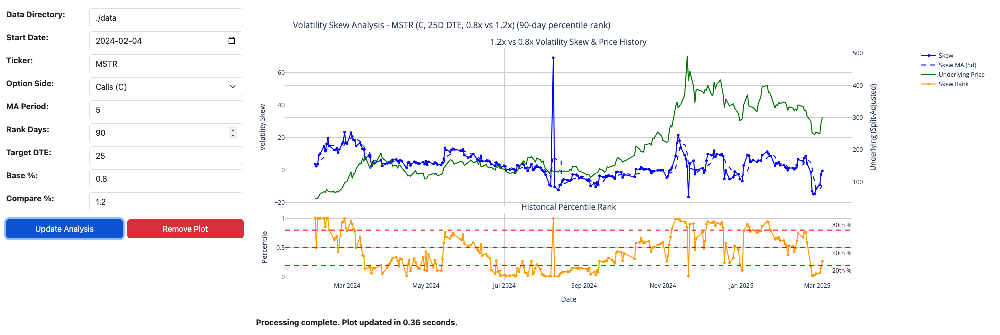
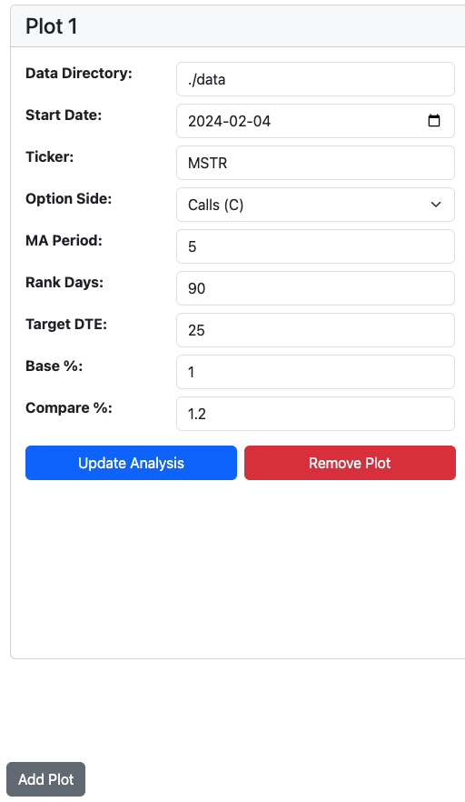
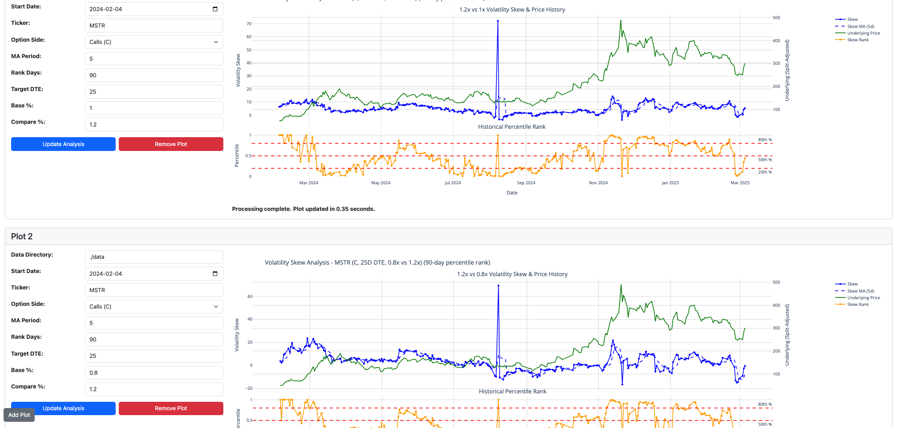
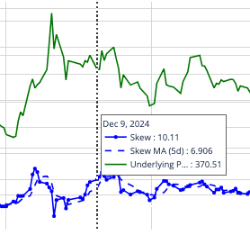
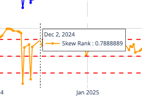
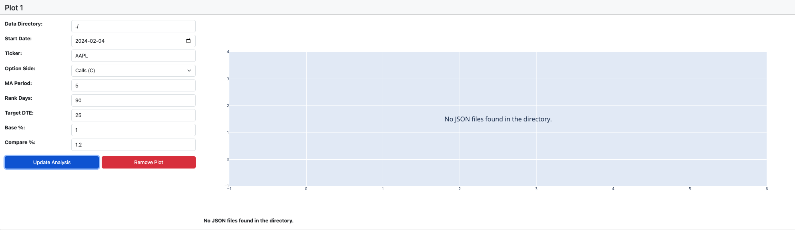
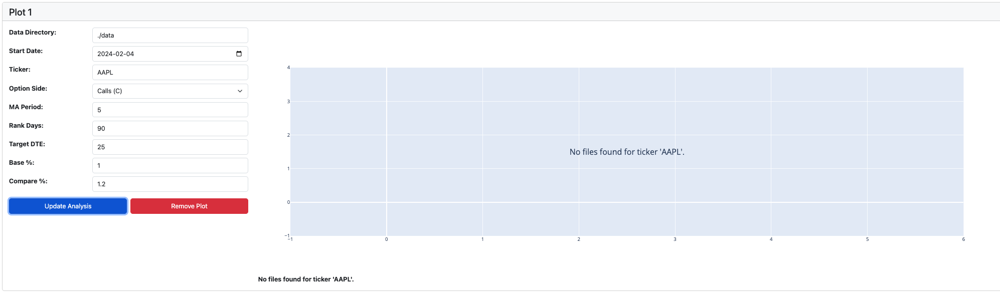
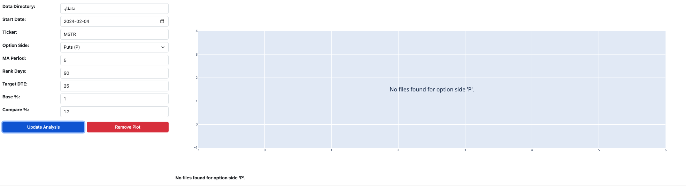

# Volatility Skew Analysis

## Overview
This program offers an interactive dashboard designed to analyze options volatility skew and its historical percentile rank. Users can select a specific ticker, choose between calls or puts, and adjust various parameters to visualize volatility skew over time. This visualization helps in identifying potential trading opportunities with ease. The dashboard supports multiple plots on the same page, enabling users to compare and assess market patterns more effectively.

## Features

- **Dynamic Data Loading:**  
  Reads JSON files from a specified directory and filters the data based on ticker, option side, and start date.

- **Moneyness-Based Skew Calculation:**  
  Calculates skew by comparing the implied volatilities at two moneyness levels (base and compare strikes) relative to the underlying price.  
  For example, with a base moneyness of `1.0x` and a compare moneyness of `1.2x`, if the underlying is `$100`, the program compares options near the `$100` strike (base) and `$120` strike (compare).

- **Rolling Metrics:**  
  - **Rolling Percentile Rank:** Computes the percentile rank of the current skew against a rolling window of historical data (`rank_days`).  
  - **Moving Average (MA):** Smooths the skew data using a user-configurable MA period (`ma_period`).

- **Dynamic Plot Management:**  
    Users can interactively add or remove multiple analysis plots on the same page, facilitating side-by-side comparison and deeper insights into the volatility skew.

- **Efficient Data Caching:**  
    Implements a global caching mechanism that stores preprocessed data based on key parameters (`directory`, `start_date`, `ticker`, and `option_side`). This ensures heavy data is loaded only once and shared efficiently across multiple plots, significantly enhancing performance and responsiveness.

- **Robust Error Handling:**
    Proactively identifies and clearly reports common issues such as missing directories, absent data files, unmatched tickers or option sides, and invalid date inputs. These clear error messages improve the user experience and simplify troubleshooting.


## How to Run
### Prerequisites

Ensure you have the following installed:

- **Python Version:** Python `3.7` or later  
- **Required Libraries:** Install dependencies using the following command:  
    ```bash
    pip install -r requirements.txt
    ```

    To verify the installed dependencies, run:  
    ```bash
    pip list | grep -E 'dash|numpy|pandas|plotly'
    ```

    If you encounter version mismatches, reinstall the exact versions specified in the `requirements.txt` file:  
    ```bash
    pip install --force-reinstall -r requirements.txt
    ```


### Running the Application

1. Clone or download the repository containing the code.
2. Open a terminal (or command prompt) in the project directory.
3. Run the application using: 
    ```
    python skew_analyzer_app.py
    ```
4. Open your web browser and navigate to `http://127.0.0.1:8050` to view the app.


## How to Use

1. **Specify Parameters:**  
In the left panel of each analysis card, enter the following:
- **Data Directory:** The folder containing your JSON data files.
- **Start Date:** Enter a date (format: `YYYY-MM-DD`) from which you want to analyze data.
- **Ticker:** The security symbol (e.g., `MSTR`).
- **Option Side:** Choose between `Calls (C)` and `Puts (P)`.
- **MA Period:** Set the moving average period (default is `5`).
- **Rank Days:** Set the number of days for the rolling percentile rank (default is `90`).
- **Target DTE:** Set the target days-to-expiration (default is `25`).
- **Base % and Compare %:** Set the multipliers for base and comparison strikes (default is `1` and `1.2`).

-   


2. **Update Analysis:**  
Click the **Update Analysis** button to load or retrieve cached data. The application will compute the volatility skew and rolling metrics, displaying the interactive plot on the right. Note that the initial plot may take up to 10 seconds to load as it processes the required data, but subsequent updates are optimized to complete in under 1 second.

-  
- If I change one param in base % to 0.8 and click to update the analysis, the update responded in 0.36 seconds.
-  


3. **Managing Multiple Plots:**  
- Use the **Add Plot** button (located at the bottom-left of the page) to add a new analysis card.
- Remove a plot by clicking the **Remove Plot** button within that analysis card.

-   
- To compare both `1 vs. 1.2%` and `0.8 vs. 1.2%` skew views, click on **Add Plot** to create a second analysis card. Adjust the parameters in the second plot accordingly. Since the same data is reused due to global caching, the second plot loads in just 0.34 seconds.  
-   
- Users can create multiple plots, all displayed on the same page, enabling comprehensive side-by-side analysis. Delete immediately, if no longer needed. 

4. **Interactivity:**  
Hover over the plot to see tooltips with detailed values. Use the Plotly toolbar to zoom, pan, and export images.
-   
-   

5. **Error Handling:**  
The program proactively handles errors by displaying specific and user-friendly messages when requested data is unavailable. Common scenarios include:

- **Invalid Data Directory:** Displays an error if the specified directory does not exist or is inaccessible.
-   

- **Unavailable Ticker:** Notifies the user when the selected ticker symbol is not found in the data.
-   
- **Unavailable Option Side:** Alerts the user if the chosen option side (Calls or Puts) is not present in the dataset.
-   
These clear error messages help users quickly identify and resolve issues, ensuring a smoother experience.


## Additional Notes

- **Global Caching:**  
Heavy data is stored in a global cache keyed by parameters (`directory`, `start_date`, `ticker`, `option_side`), preventing redundant data reads and significantly improving responsiveness.

- **Code Organization:**  
The code is modular:
- **`diagnose_missing_data`**: Checks for missing or invalid data conditions.
- **`load_and_preprocess_data`**: Loads, filters, and preprocesses the JSON data.
- **`compute_skew_figure_from_data`**: Calculates skew, rolling metrics, and builds the Plotly figure.
- **Dash callbacks**: Manage dynamic UI elements and caching.
